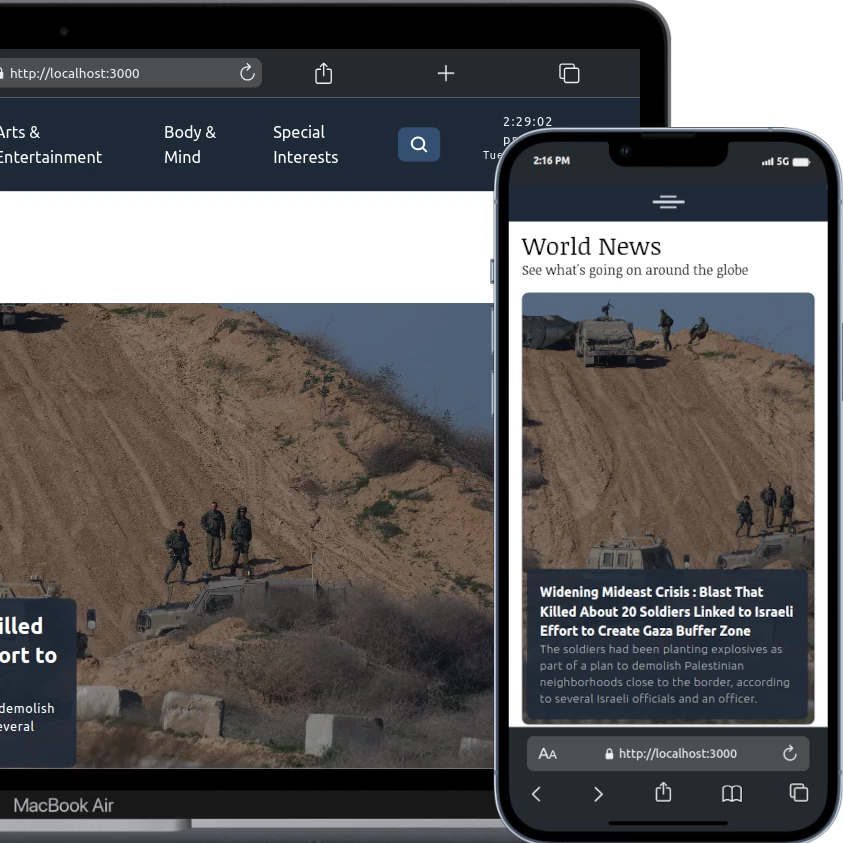

# News Link Now

### A Next.js Application that utilizes the NYTimes API.

This application features up-to-date news articles that are fetched directly from the New York Times API. This application is mobile responsive ( by way of TailwindCSS ).

News articles can be found on all topics covered by the New York Times. Furthermore, I have included the ability to search via a search (popup) modal that uses the search endpoint of the API.

News Link Now is SEO Compliant, including detailed metadata for every page.

You will find lots of dynamic goodies in this application, with more to come. As for now, enjoy this app as it puts the latest news within your reach.

### USAGE

If you would like to give this site a go, you can access it at [news-link-now.vercel.app](https://news-link-now.vercel.app/)

### CONTACT

[wlowrimore@gmail.com](mailto://wlowrimore@gmail.com) 
[www.williamlowrimore.com](https://www.williamlowrimore.com) 
[www.linkedin.com](https://www.linkedin.com/in/william-lowrimore)
